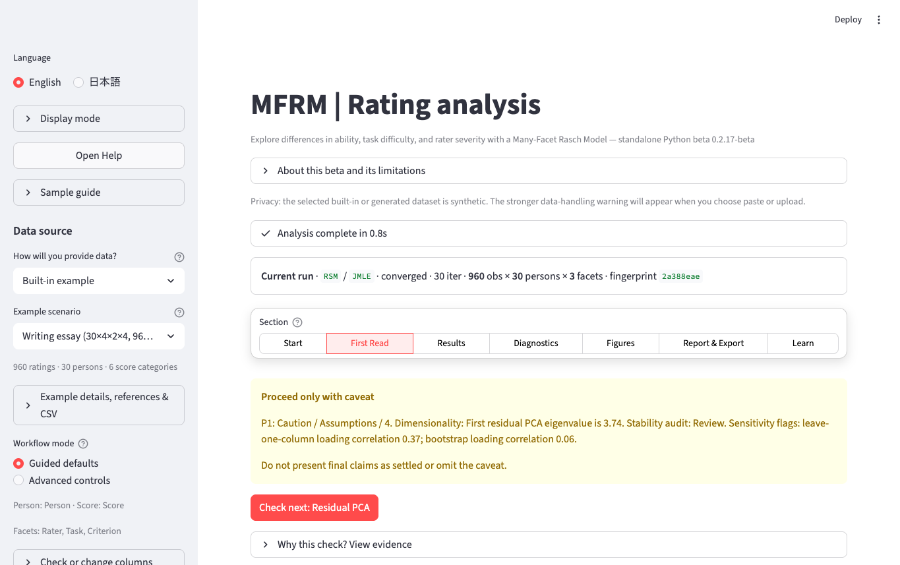

# MFRM Streamlit

Standalone Python beta application for Many-Facet Rasch Model estimation in Streamlit.

This app is designed to run without `mfrmr`, `rpy2`, `Rscript`, FACETS, TAM, sirt, or mirt at runtime. Those tools are used only as external methodological references for validation and interpretation.

## Status

- Release status: public beta / research preview (**v0.2.14-beta**; current branch also includes the Unreleased items in `CHANGELOG.md`)
- Runtime engine: standalone Python
- Primary entrypoint: `streamlit_app.py`
- Intended use: exploratory analysis, teaching, reporting support, and research workflow prototyping
- Not intended as: a validated drop-in replacement for FACETS, TAM, sirt, mirt, or `mfrmr`

Before using results for high-stakes scoring, placement, certification, employment, or institutional decisions, cross-check the analysis with an established workflow and document the model assumptions.

## What's new in the current beta line

The current app label is v0.2.14-beta. This branch also includes Unreleased
refinements documented in `CHANGELOG.md`, including mfrmr 0.1.6 migration
coverage, EB shrinkage advisory outputs, facet sample-size / nesting / design
effect audits, information curves, and public-facing wording cleanup.

Earlier v0.2.0-beta (2026-04-17) shipped four major feature tracks; v0.2.1 and
v0.2.2 were post-release hotfixes landing the findings from a parallel UX audit.
Those foundational features are summarized below; see `CHANGELOG.md` for the
full per-version breakdown.

### New in v0.2.0

- **📄 Publication Document downloads** — one click to produce a
  manuscript-ready Word (.docx), PDF, or HTML file with auto-generated
  abstract, exhaustive Methods, results tables, embedded figures, and an
  APA 7 reference list. Accessible from **Report → 💾 Exports**.
- **🧮 Posterior Viewer mode** — upload posterior draws produced offline
  (CmdStan CSV, Apache Parquet, or ArviZ NetCDF) and get trace / ridge
  / pair / forest plots plus HMC diagnostics (Rhat, ESS, divergences,
  E-BFMI) without leaving the browser. Select the mode from the sidebar top.
- **🧪 Advanced model Stan generators** (download-only) — DINA, HRM,
  Testlet (Random Intercept + Bifactor), Mixture Rasch, 2PL Binary,
  and Pairwise BTL. The app emits a `.stan` file + data bundle; you
  compile and sample locally with cmdstan / cmdstanpy / rstan, then
  bring the draws back to the Posterior Viewer.
- **Pattern-matched estimation errors** — instead of a generic "common
  causes" checklist, failures now surface a specific diagnosis + action
  (singular matrix → non-centered facet, maxit reached → raise to 1000,
  rating scale error → check Score column, …).
- **Pre-estimation readiness panel** — 🟢 / 🟡 / 🔴 traffic-light across
  eight data-quality checks before the Run button fires.
- **Run history + two-run comparison** — up to 5 recent runs sit behind a
  Restore button (v0.2.1 lowered the cap from 10 → 5 for Community Cloud
  memory safety); pick any two to compare convergence, element-level
  Pearson r + RMSE, and reliability in a side-by-side panel.
- **Step-by-step progress** — `st.status` accordion reports Estimate →
  Diagnostics → Report tables → Bias interactions instead of a silent
  spinner, with a completion toast.
- **Surface-reason diagnostics** — residual PCA, bias interaction, and
  reliability now explain *why* they were skipped instead of returning
  a blank "not available".

### New in v0.2.1 (first UX-audit hotfix pass)

- **🎯 Download sample CSV** — inspect the built-in demo dataset's
  column structure before preparing your own upload.
- **Upload size preflight** — ≥50 MB warns, ≥100 MB errors, before
  pandas parsing consumes memory on Streamlit Community Cloud.
- **Clear-history confirmation** — the 🗑 Clear history button now
  requires an explicit "Yes, delete all N snapshots" confirmation.
- **Downloads tab signpost** — a clear pointer to Publication Document
  so users don't hunt for the Word / PDF export.
- **Config JSON import** — upload a previously downloaded config to
  inspect its settings as a table (read-only).
- **Accessibility CSS** — `:focus-visible` outline for keyboard users,
  `prefers-reduced-motion` support, narrow-screen (<900 px) layout.
- **Traffic-light text redundancy** — 🟢 / 🟡 / 🔴 icons now also carry
  [OK] / [CAUTION] / [ISSUE] labels for colour-blind users.

### New in v0.2.2 (second UX-audit hotfix pass)

- **📖 MFRM / Bayesian quick-reference glossary** — 20-term table
  (logit / Infit / Outfit / MnSq / ZSTD / step facet / Rhat / ESS / …)
  surfaced under Help → Glossary.
- **Run breadcrumb** — a persistent one-line banner above the results
  showing model / method / convergence / counts / fingerprint so users
  always know which run they are viewing after a history restore.
- **Measure table reorder** — Facet / Level / Estimate / SE / CI /
  Infit / Outfit columns are surfaced first; Anchor / N / metadata
  move to the tail.
- **Fit-cell colour highlighting** — Infit / Outfit mean-square cells
  colour-coded to the Wright & Linacre (1994) interpretation bands
  (🟩 0.5–1.5 acceptable · 🟧 1.5–2.0 noisy · 🟥 ≥ 2.0 distorting ·
  🟨 < 0.5 over-fit).
- **Scree plot EV = 3 reference line** — previously only EV = 1 and
  EV = 2 were drawn; the "EV > 3 = strong secondary dimension"
  threshold is now visible on the plot itself.
- **Stan `application/x-stan` MIME** — browsers save .stan files
  correctly and Stan-aware editors pick up syntax highlighting.
- **Help tab refresh** — Quick Start documents all v0.2.x features;
  Troubleshooting cites the new diagnostic helpers.

See `CHANGELOG.md` for the per-commit breakdown and
`docs/v0.2.0_beta_plan.md` for the original v0.2.0 release checklist.

## Preview



The screenshot uses the built-in synthetic sample data. It highlights the
default guided sidebar, the visible data-privacy warning, the input preview,
the post-estimation success status, and the beginner-oriented result tabs.

## Data Privacy

Rating data can contain person IDs, rater IDs, school or institution identifiers, subgroup labels, and other sensitive information.

For confidential data, run the app locally on a controlled machine:

```bash
streamlit run streamlit_app.py
```

If the app is deployed to Streamlit Community Cloud or another hosted platform, uploaded data may be processed on remote infrastructure. Confirm your institutional data-handling requirements before upload. Prefer removing direct identifiers, limiting uploaded columns to analysis variables, and avoiding hosted deployments for regulated or confidential datasets.

The app is intended to keep uploaded data in memory during the session unless the user explicitly downloads or exports outputs.

## Install

Use a virtual environment:

```bash
git clone https://github.com/Ryuya-dot-com/MFRM_Python_Application.git
cd MFRM_Python_Application
python3 -m venv .venv
source .venv/bin/activate
python -m pip install --upgrade pip
python -m pip install -r requirements.txt
```

For local verification and CI-equivalent smoke tests, install the development dependencies:

```bash
python -m pip install -r requirements-dev.txt
```

## Run

```bash
streamlit run streamlit_app.py
```

For a first local smoke check, keep **Sample data (built-in)** selected (the
default scenario — ✏️ Writing essay — is loaded automatically), leave the
guided defaults unchanged, click **Run FACETS-mode estimation**, then open the
**What should I look at first?**, **Data**, **Visuals**, and **Help** tabs.
Other built-in scenarios switchable from the **📥 Data source** radio:
*📚 Large-scale writing* (PCA-ready), *🎙️ L2 speaking* (analytic-rubric /
PCM), *🏥 Clinical OSCE* (station-dominant), *📖 Reading testlet — binary*
(0/1 scoring with item-text-person nesting). Each scenario's sidebar
**📚 About this dataset** expander lists its APA 7 references.

For deployment notes, including Streamlit Community Cloud settings and privacy gates for hosted use, see `DEPLOYMENT.md`.

## Verify

```bash
python -m py_compile streamlit_app.py
python streamlit_app.py --doctor
python streamlit_app.py --release-check
python streamlit_app.py --self-test
python -m pytest tests
python streamlit_app.py --benchmark-quick --benchmark-csv validation/generated/benchmark_smoke.csv
python streamlit_app.py --export-demo-report validation/generated/demo_report
python streamlit_app.py --export-parity-fixture validation/generated/parity_fixture
```

Optional Make shortcuts:

```bash
make verify
make clean
make run
```

## Data Format

Use long-format rating data. The interactive upload path accepts CSV, TSV, TXT,
Excel `.xlsx` / `.xlsm` (first worksheet), Apache Parquet, and JSON / JSON-lines.
Pasted spreadsheet text supports comma, tab, or semicolon delimiters.

```csv
Person,Rater,Task,Criterion,Score
P01,R1,T1,C1,4
P01,R2,T1,C1,5
P02,R1,T2,C2,2
P02,R2,T2,C2,3
```

Required:

- Person column
- Score column with ordered integer categories
- One or more facet columns such as rater, task, criterion, prompt, form, or occasion

Supported score handling includes:

- Intended rating boundaries, such as 1 to 5
- Zero-count intermediate categories, such as a 1-5 scale where category 3 is absent
- Optional recoding of non-consecutive observed categories
- Rejection of fractional categories with a clear error

### Paste From a Spreadsheet

Teachers and workshop users can paste directly from Excel, Google Sheets, or a
gradebook export. Keep the first row as column names, then select the cells and
copy/paste them into **Data source → Paste CSV/TSV text** in the sidebar.

```csv
Student,Rater,Assignment,Criterion,Score
S01,TeacherA,Essay1,Content,4
S01,TeacherA,Essay1,Organization,3
S01,TeacherB,Essay1,Content,5
S02,TeacherA,Essay1,Content,2
```

When mapping columns in the app, choose `Student` as **Person**, `Score` as
**Score**, and use `Rater`, `Assignment`, and `Criterion` as facets. Do not paste
total scores if rubric-level ratings are available; one row should represent one
rating event.

## Model Scope

Implemented in the standalone Python engine:

- RSM
- PCM
- bounded GPCM
- JMLE
- MML via EM, Direct, Hybrid, and Auto engine selection
- latent regression via constrained `population_formula`
- fixed user-set population prior SD for the current MML population model path
- EAP posterior scoring
- plausible values
- strict marginal diagnostics
- residual PCA diagnostics
- bias / local interaction screening with DFF-style sparse-cell, Holm, BH/FDR,
  and practical-logit review flags
- anchor audit and linking review
- anchor drift and equating-chain summaries
- anchor/equating workflow checklist for current-run linking evidence
- prediction for fitted, held-out, and scenario rows
- simulation and design evaluation
- final-report readiness checklist
- visual interpretation checklist for beginner-friendly figure reading
- latent-regression covariate type preview for numeric IDs/codes that may need categorical coding
- downloadable tables, configuration, scripts, and method appendix
- reproducibility/config fingerprints for analysis exports

## Beginner Reporting Workflow

After fitting a model, inspect results in this order:

1. Convergence: do not interpret final measures until the optimizer converges.
2. Category functioning: check sparse categories, monotonic average measures, and threshold order.
3. Reliability / separation: confirm whether the design supports stable person and facet ordering.
4. Wright map targeting: check whether person locations and facet difficulty/severity ranges overlap.
5. Fit diagnostics: review large standardized residuals and misfitting elements.
6. Bias / local interaction: treat DFF/bias flags as review prompts, not automatic proof of bias.
7. PCA / dimensionality: check whether residual structure suggests a second dimension.
8. Anchor / linking review: check connectedness and anchor stability before comparing runs or groups.
9. Strict marginal diagnostics: use for final MML reports when feasible.
10. Publication gate: check whether APA-style conclusions are ready, caveated, or blocked.
11. Submission action plan: fix prioritized blockers, caveats, boundaries, and wording repairs before manuscript use.
12. Beginner case guidance: review common interpretation traps and safer wording repairs detected in the current run.
13. Final-report readiness: use the generated checklist before writing conclusions.
14. Manuscript claim guide: check what is safe to claim, what requires a caveat, and what should not be claimed yet.
15. Manuscript template: adapt the generated Methods, Results, limitations, and reviewer preflight scaffold after resolving claim-guide cautions.

The final-report readiness checklist, publication gate, submission action plan,
first-read guide, manuscript template, and generated report text use the same main thresholds:
about 5% or fewer observation residuals with `|z| >= 2`, person reliability at
least 0.80 when person separation is the goal, and residual PCA first eigenvalue
below 2.0 for a clean screen.

For MML latent regression, inspect the covariate type preview before fitting.
Integer-like columns such as `GradeCode = 1, 2, 3` are flagged so you can decide
whether they are continuous predictors or category labels that should be forced
categorical.

The app and demo export also include a manuscript claim guide, public-beta
limitations, and release readiness tables. The submission action plan combines
these sources into a prioritized first-read table so public claims stay aligned
with what the standalone Python engine currently supports.
In the app UI, wide reporting tables show the most important columns first,
wrap short guide tables for reading, and place full-detail tables in expanders;
downloads still contain the complete columns. On desktop screens, long result-tab
bars wrap instead of forcing users to rely on horizontal scrolling.
The same public-beta bundle includes `mfrmr_015_migration_coverage.csv` and
`mfrmr_016_migration_coverage.csv`, which map the mfrmr package feature surface
through 0.1.6 to Python support, boundaries, and next validation actions.
The 0.1.6 map covers the new post-hoc EB shrinkage advisory, facet sample-size
adequacy, nesting/crossing screens, intraclass-cluster-ICC design effect,
information curves, and misfit/weighting audit support.

The Visuals tab also includes a downloadable visual interpretation checklist.
It maps each figure to the first signal to read, the review trigger, and the
recommended next action for beginners.
It also includes a visual method evidence table that links each plot family to
its Rasch/MFRM diagnostic role and explains the app's readability rules.
Figure exports use a manuscript profile: white background, consistent font,
compact margins, 300 DPI PNG when static export is available, and matching
interactive HTML for inspection. The figure bundle includes `figure_manifest.csv`
with the recommended manuscript use and reporting caution for each figure.
For PCM and bounded GPCM, category probability curves can be read either as an
averaged overview or for each selected step-facet level. The downloadable table
bundle also includes long-form curve data for all available curve scopes.

To generate a synthetic beginner-facing report without uploading data:

```bash
python streamlit_app.py --export-demo-report validation/generated/demo_report
```

Open `validation/generated/demo_report/MFRM_Demo_Report.html` first, then read
`publication_gate_summary.csv`, `submission_action_plan.csv`,
`beginner_case_guidance.csv`,
`final_report_readiness.csv`,
`manuscript_claim_guide.csv`,
`manuscript_template.md`,
`visual_interpretation_checklist.csv`, `visual_method_evidence.csv`,
`public_beta_limitations.csv`, `mfrmr_015_migration_coverage.csv`,
`mfrmr_016_migration_coverage.csv`, `public_release_readiness.csv`,
`figure_manifest.csv`,
`MFRM_Demo_Publication_Figures.zip`, and the interactive diagnostic figures in
`figures_html/`.

## Statistical Caveats

- GPCM is not a strict Rasch model. Its slope parameters change the interpretation of invariance and should be reported explicitly.
- The current latent regression path uses the app's documented population prior SD behavior. Do not describe it as identical to TAM unless the model, quadrature, variance treatment, and constraints have been checked.
- Bias and differential functioning outputs are screening tools unless linking, common-scale evidence, sample size, and precision support stronger claims.
- Cross-package equality is not expected by default because FACETS, TAM, sirt, mirt, and this app can use different parameterizations, constraints, latent variance handling, and optimization details.
- Treat external R cross-check outputs as validation evidence, not as a runtime dependency.
- Reproducibility fingerprints help confirm that a report came from the same data/settings, but they are not a privacy guarantee or encryption method.

## Caching

- `st.cache_resource` is used only for the read-only core function namespace.
- `st.cache_data` is used for built-in sample data, bundled anchor templates/guidelines, and short-lived export bytes keyed by reproducibility fingerprints.
- Uploaded or pasted rating data are not cached as a resource. Export-byte caches are bounded and short-lived, but confidential analyses should still be run locally.

## Figure Exports

Interactive HTML figure exports are always attempted. Static PNG exports use
Plotly/Kaleido and require Chrome or Chromium in the runtime when using
`kaleido >= 1.0`; if that browser dependency is unavailable, the app falls back
to interactive HTML figures instead of blocking the analysis.

## External Reference Roles

- TAM: faceted MML design, latent regression, EAP, and multifacet reference checks.
- mirt: GPCM, EAP/factor scores, plausible values, and broader IRT diagnostics.
- sirt: rater-facet and hierarchical rater model reference checks.
- mfrmr: functional capability reference for the Python migration target.

For the cross-package validation matrix and tolerance policy, see `validation/README.md`.
For the archived optional R smoke status, see
`validation/R_CROSSCHECK_STATUS.md`.
For the archived external numerical-validation inventory, see
`validation/SIMULATION_REFERENCE_STATUS.md`.
The parity fixture also includes official documentation touchpoints, an
artifact checklist, an archived validation-artifact inventory, an external
validation report template, sanitized Python/R/Julia Simulation validation
templates, and the mfrmr 0.1.5 / 0.1.6 migration coverage tables so external
checks can be archived without making R packages or private validation artifacts
runtime dependencies.

## Continuous Integration

The app-specific workflow is in:

```text
.github/workflows/python-streamlit.yml
```

It runs:

- dependency installation
- `python -m py_compile streamlit_app.py`
- `python streamlit_app.py --doctor`
- `python streamlit_app.py --release-check`
- `python streamlit_app.py --self-test`
- `python streamlit_app.py --benchmark-quick --benchmark-csv validation/generated/benchmark_smoke.csv`
- Streamlit AppTest smoke check
- demo report export smoke check
- parity fixture export smoke check

If this directory is used as a standalone GitHub repository, the workflow will be discovered normally. If it remains a subdirectory inside a larger repository, copy or mirror the workflow into the repository root `.github/workflows/` directory.

## License

MIT License. See `LICENSE` and `LICENSE_NOTICE.md`.

Commercial use is permitted, including paid teaching, consulting, internal
training, hosted demonstrations, and product evaluation. The app and
documentation are provided as-is, without warranty. Users are responsible for
data privacy, model assumptions, interpretation, external validation, and
institutional approval before relying on outputs in operational or high-stakes
settings.

We intentionally do not use CC BY-NC because the NonCommercial restriction would
conflict with the intended permission for commercial use. If documentation or
teaching excerpts are reused separately, keep attribution and do not imply author
endorsement.

## Publication Note

This repository is the publication target for the standalone Streamlit app.
Keep generated validation outputs, private datasets, and machine-specific paths
out of the public branch unless they have been explicitly sanitized.

## Files

```text
Makefile
streamlit_app.py
requirements.txt
requirements-dev.txt
LICENSE
README.md
DEPLOYMENT.md
CHANGELOG.md
CONTRIBUTING.md
SECURITY.md
MFRM_STREAMLIT_RELEASE_PLAN.md
RELEASE_CHECKLIST.md
anchor_templates_and_guideline/
locales/
.streamlit/config.toml
.github/workflows/python-streamlit.yml
.github/ISSUE_TEMPLATE/
docs/images/app-data-overview.png
```

Generated files such as `__pycache__`, benchmark CSVs, local logs, and validation output directories are ignored.
